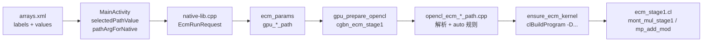

# Android ECM：高级算子路径（mul / sqr / add / sub）映射说明

本文说明 APK「高级选项」里四个下拉框（`ecm_mul_path_labels` 等）如何传到 native 层、如何参与 OpenCL **编译期**宏选择，以及最终在 `kernel_double_add` 内调用哪段 CL 实现。

桌面 `ecm.exe` 使用同一套 path 字符串（命令行 `--mul` / `--sqr` / `--add` / `--sub`），host 逻辑在 `src/cgbn_stage1_opencl.cpp` 与 `src/opencl_ecm_*_path.cpp`，与 Android 共用。

> **提醒：** `GPU: CGBN<512,8>` 与 `mul=mont_mul_priv_unroll_only_384` 可同时出现，并非错误。容器位宽（512）与 Montgomery 算子宽度（384/12-limb）是两层概念 — 详见 **[`DEV_ECM_CGBN_CONTAINER_VS_MONT.md`](DEV_ECM_CGBN_CONTAINER_VS_MONT.md)**。

---

## 1. 总览



一次 ECM 运行只编译/缓存 **一个** OpenCL program（入口 kernel 名固定为 `kernel_double_add`）。  
路径选项不切换「不同的 .cl 文件 kernel 名」，而是通过 **预处理器宏** 在编译时选定 Montgomery 乘/方与模加/模减的实现；运行时在 `double_add_v2` 等内联函数里调用 `mont_mul_stage1` / `mp_add_mod`。

---

## 2. UI 层：标签与内部值

定义文件：`Android/ECM/app/src/main/res/values/arrays.xml`

每个算子有两列数组，**同索引一一对应**：

| 数组 | 用途 |
|------|------|
| `ecm_*_path_labels` | 下拉框显示文案 |
| `ecm_*_path_values` | 传给 native 的内部字符串 |

`MainActivity.kt`：

1. `setupEcmPathDropdowns()` — 用 labels 填充 `AutoCompleteTextView`，把 values 存到 `dropdown.tag`。
2. `selectedPathValue()` — 根据当前显示 label 查回 value。
3. `pathArgForNative()` — `"auto"` 或空 → 传 **空字符串** `""`（表示 host 默认/auto）；其它原样传递。

```kotlin
// 默认「自动」→ native 收到 ""
pathArgForNative(selectedPathValue(inputMulPath))
```

JNI 签名：`nativeRunEcm(..., mulPath, sqrPath, addPath, subPath, ...)`  
实现：`Android/ECM/app/src/main/cpp/native-lib.cpp` → `ecm_android_run.cpp`。

空字符串不会写入 `params->gpu_mul_path`（保持全零），后续 C 代码里以 `nullptr` 表示 auto：

```cpp
params->gpu_mul_path[0] ? params->gpu_mul_path : nullptr
```

---

## 3. Host：N 位数与 CGBN 容器

在 `cgbn_ecm_stage1()` 中：

```cpp
const size_t n_log2 = mpz_sizeinbase(N, 2);   // N 的真实位数，auto 规则用这个
const ecm_stage1_mont_mode mont_mode =
    opencl_ecm_resolve_stage1_mont_mode(gpu_mul_path, gpu_sqr_path, n_log2);
const bool use_i24 = opencl_ecm_stage1_should_use_i24(mont_mode, n_log2, verbose);

// 32-bit 容器（非 i24）
uint32_t BITS = select_bits(n_log2);   // 512, 1024, …, 4096
uint32_t limbs = BITS / 32;            // 16, 32, …, 128

// i24 容器（use_i24 时覆盖 limbs/BITS）
limbs = ecm_limb24_stage1_limbs(n_log2);   // ceil((N+CARRY)/24)
BITS  = ecm_limb24_mont_bits(limbs);        // limbs × 24
```

| N 位数（约） | 32-bit 容器 BITS / limbs | mul/sqr **auto** Montgomery | 说明 |
|-------------|--------------------------|----------------------------|------|
| `< 288` | i24：`limbs×24` mont bits | `i24_u32_blsub` | 见 `ecm_limb24_stage1_limbs()` |
| `288 … 377` | **512 / 16** | `unroll_only_384`（12-limb CIOS） | 容器仍 512；算子 384 宽 — 见 [容器 vs 算子](DEV_ECM_CGBN_CONTAINER_VS_MONT.md) |
| `378 … 506` | 512 / 16 | `unroll_only_512` | `N + CARRY ≤ 512` |
| `507 …` | 1024 … | `priv_opt` 或 4096 路径 | `select_bits` 升档 |

**4096 专用 path**（`unroll64_4096`、`fips4096` 等）仅在 `limbs == 128` 时使用；否则 host 打印 warning 并清零 `mul_path`/`sqr_path`。

**Auto 选内核与容器是两件事：** `n_log2` 决定 **用哪种 Montgomery 实现**；`select_bits` / `ecm_limb24_stage1_limbs` 决定 **编译 `-DMAX_LIMBS=` 与数据步长**。unroll384 合法范围是 **`N + CARRY < 384`**，不是 512 容器上限 — 详见 [`DEV_ECM_CGBN_CONTAINER_VS_MONT.md`](DEV_ECM_CGBN_CONTAINER_VS_MONT.md) 与 §9。

---

## 4. Montgomery 路径（mul / sqr）

### 4.1 解析：`opencl_ecm_mont_path.cpp`

| UI / CLI 字符串 | `opencl_ecm_parse_mont4096_path` | 用途 |
|-----------------|-----------------------------------|------|
| `""`, `auto`, `default` | `0` (UNROLL64) | 4096 默认 unroll64 |
| `i24_u32`, `i24_u32_blsub` | `0`（非 4096 id） | 见 §4.2 |
| `i24_384_manual`（CLI 遗留） | `0` | 等同 `i24_u32_blsub` |
| `unroll_only_512` | `0` | 见 §4.2 |
| `unroll64_4096` | `0` | 4096 默认 |
| `unroll64_4096_mt2` | `1` | 4096 + coop WG=2 |
| `fips4096` | `2` | FIPS4096 单线程 |
| `fips4096_mt8` | `3` | FIPS4096 × 8 |
| `fips4096_mt16` | `4` | FIPS4096 × 16 |

### 4.2 Stage-1 模式（&lt;4096-bit，尤其 512 容器）

**Auto 按 N 位数选内核的完整改法见 §9。** 此处为当前规则摘要。

`opencl_ecm_resolve_stage1_mont_mode(mul, sqr, n_bit_size)` 在 **编译 kernel 之前** 决定变体：

| 条件 | 模式 | 日志 mul / sqr |
|------|------|----------------|
| mul 或 sqr 为 `unroll_only_512` | `UNROLL512` | `mont_mul_priv_unroll_only_512`（仅 limbs=16） |
| mul 或 sqr 为 `unroll32` | `UNROLL32` | `mont_mul_stage1_unroll32` |
| mul 或 sqr 为 `priv_opt` | `PRIV_OPT` | `mont_mul_stage1_priv_opt` |
| mul 或 sqr 为 `unroll_only_384` 且 `N+CARRY<384` | `UNROLL384` | `mont_mul_priv_unroll_only_384` |
| mul 或 sqr 为 `unroll_only_384` 但 N 过大 | `UNROLL512` | warning 后回落 unroll512 |
| mul/sqr 均为 auto 且 `n < 288` | `I24_U32_BLSUB` | `mont_mul_unroll_i24_u32_blsub` |
| mul/sqr 均为 auto 且 `288 ≤ n ≤ 377` | `UNROLL384` | `mont_mul_priv_unroll_only_384` |
| mul 或 sqr 为 `i24_u32` | `I24_U32` | `mont_mul_unroll_i24_u32` |
| 其它 auto（如 `378 … 506`） | `UNROLL512` | `mont_mul_priv_unroll_only_512`（limbs=16） |

i24 是否启用由 `opencl_ecm_stage1_should_use_i24(mode, n_bit_size)` 决定（与 32-bit `select_bits` 无关）。i24 使用独立 limb 计数：

```text
i24_limbs = ceil((n_bit_size + CARRY_BITS) / 24)   // 991-bit → 42 limbs
mont_bits = i24_limbs × 24                           // 991-bit → 1008-bit Montgomery
```

32-bit 路径仍用 `select_bits(n) → limbs = BITS/32`（991-bit → 1024-bit / 32 limbs）。

Stage-1 内调用 `mont_mul_unroll_i24_u32_*_priv_body`（private 指针 ABI，算法与 global bench 的 `mont_mul_unroll_i24_u32_*_body` 相同）。

**与 bench 区分：** `mont_mul_unroll_i24_384_manual_generated.cl` 是 Montgomery **bench 专用**全展开内核，**不会**编入 Stage-1。

i24 启用时 host 还会：

- prepend `mont_mul_unroll_i24.cl`（局部去掉 `#pragma once` / `__global` / `__constant`）
- 用 `ecm_limb24_from_mpz` 编码 N 与曲线数据
- 编译加 `-DMAX_LIMBS=<i24_limbs>`（非 `BITS/32`）、`-DECM_STAGE1_USE_I24_384=1`、`-DMP_LIMB_BITS=24`
- Checkpoint：`header.BITS = mont_bits`（如 1008），`data_size = 5×curves×i24_limbs×4`；可用 `ecm_checkpoint_is_i24_layout(bits, limbs)` 识别

### 4.3 编译宏 → `ecm_stage1.cl` 内联函数

`ensure_ecm_kernel()` 调用 `clBuildProgram`，关键 `-D`：

```
-DMAX_LIMBS=<limbs>
-DECM_STAGE1_MUL_PATH=<mul_path>      // 0..4，4096 专用
-DECM_STAGE1_SQR_PATH=<sqr_path>
-DECM_STAGE1_USE_I24_384=<0|1>
-DECM_STAGE1_I24_U32_BLSUB=<0|1>     // 1=blsub, 0=branchy u32
-DECM_STAGE1_FORCE_UNROLL32=<0|1>
-DECM_STAGE1_FORCE_UNROLL384=<0|1>
-DECM_STAGE1_FORCE_PRIV_OPT=<0|1>
-DECM_STAGE1_COOP_WG=<1|2|8|16>       // limbs==128 且 mt* 路径
-DECM_STAGE1_HAS_FIPS4096=<0|1>       // 是否链接 ecm_stage1_mont4096_paths.cl
```

`mont_mul_stage1()` / `mont_sqr_stage1()` 分发（`ecm_stage1.cl`）：

| limbs | 条件 | OpenCL 实现 |
|-------|------|-------------|
| `MAX_LIMBS` | `ECM_STAGE1_USE_I24_384` + blsub / u32 | i24 `*_priv_body` |
| 任意 | `ECM_STAGE1_FORCE_UNROLL32` | `mont_mul_stage1_unroll32` |
| 任意 | `ECM_STAGE1_FORCE_PRIV_OPT` | `mont_mul_stage1_priv_opt` |
| 16 | `ECM_STAGE1_FORCE_UNROLL384` | `mont_mul_stage1_unroll_only_384` |
| 16 | 否则 | `mont_mul_stage1_unroll_only_512` |
| 128 | `ECM_STAGE1_MUL_PATH == 2` | `mont_mul_stage1_fips4096` |
| 128 | 否则 | `mont_mul_stage1_unroll64_4096` |
| 其它 | — | `mont_mul_stage1_priv_opt` |

4096 且 `ECM_STAGE1_COOP_WG > 1` 时走 `mont_*_stage1_coop()`，按 `ECM_STAGE1_MUL_PATH` / `SQR_PATH` 选 mt2 / fips mt8 / mt16 等（见 `ecm_stage1.cl` 约 1220 行起）。

运行日志确认行：

```
GPU: stage1 operators: mul=..., sqr=..., addmod=..., submod=...
```

---

## 5. 模加 / 模减路径（add / sub）

### 5.1 解析：`opencl_ecm_addsub_path.cpp`

| UI value | enum id | 名称 |
|----------|---------|------|
| `""` / `auto` | （解析为 -1，走 resolve） | 见 §5.2 |
| `fused` | 0 | `fused` |
| `fused_unroll` | 1 | `fused_unroll` |
| `fused_unroll_b32` | 2 | `fused_unroll_b32` |
| `asm_b32` | 3 | `asm_b32` |
| `fused_unroll_b16` | 4 | `fused_unroll_b16` |
| `asm_b16` | 5 | `asm_b16` |

sub 下拉无 `asm_b16`（与 desktop CLI 一致）。

### 5.2 Auto 默认（`opencl_ecm_resolve_addsub_path`）

| limbs | GPU 厂商 | add 默认 | sub 默认 |
|-------|----------|----------|----------|
| 128 (4096) | AMD | `asm_b32` | `fused_unroll_b32` |
| 128 | 其它 | `fused_unroll_b32` | `fused_unroll_b32` |
| 16 (512) | AMD | `asm_b16` | `fused_unroll_b16` |
| 16 | 其它（Adreno） | `fused_unroll_b16` | `fused_unroll_b16` |
| 其它 | — | `fused_unroll` | `fused_unroll` |

**i24 模式**（`ECM_STAGE1_USE_I24_384`）：仍按上述 id 编译，但 `mp_add_mod` / `mp_sub_mod` 在 `limbs==16` 时优先调用 **`mp_*_fused_unroll_i24`**（24-bit limb radix），与 Montgomery i24 数据布局一致。

### 5.3 编译期注入

```
-DECM_STAGE1_ADDMOD_PATH=<add_path>
-DECM_STAGE1_SUBMOD_PATH=<sub_path>
-DECM_STAGE1_ASM_B32=<0|1>   // 为 true 时 prepend asm_block32_stage1.cl
-DECM_STAGE1_ASM_B16=<0|1>   // 为 true 时 prepend asm_block16_stage1.cl
```

`mp_add_mod()` / `mp_sub_mod()` 按 `ECM_STAGE1_*_PATH` 与 `limbs` 选择 `mp_add_mod_fused_unroll_b16_512`、`mp_add_mod_asm_b32_4096` 等（`ecm_stage1.cl`）。

---

## 6. `ecm_mul_path_labels` 完整对照表

以下为 **mul 下拉**（sqr 与 mul 选项集相同；add/sub 见 §5）。

| 显示 label（arrays.xml） | value → native | Host 解析 | 实际 OpenCL（典型：301-bit N） | 实际 OpenCL（4096-bit N） |
|--------------------------|----------------|-----------|--------------------------------|---------------------------|
| 自动 (&lt;384b → i24_u32_blsub) | `auto` → `""` | auto + N&lt;384 | `mont_mul_unroll_i24_u32_blsub` | N/A |
| 自动（N≥384） | `auto` → `""` | auto → unroll512 | `mont_mul_priv_unroll_only_512` | `unroll64_4096` |
| `i24_u32_blsub` | 同左 | 强制 blsub | `mont_mul_unroll_i24_u32_blsub` | i24 不启用 |
| `i24_u32` | 同左 | 强制 branchy u32 | `mont_mul_unroll_i24_u32` | i24 不启用 |
| `unroll_only_512` | 同左 | 强制 512 | `mont_mul_priv_unroll_only_512` | 512 路径（若 limbs=16） |
| `unroll64_4096 (4096-bit)` | `unroll64_4096` | path id 0 | 被 ignore（warning） | `mont_mul_stage1_unroll64_4096` |
| `unroll64_4096_mt2` | `unroll64_4096_mt2` | path id 1 | ignore | unroll64 + coop WG=2 |
| `fips4096` | `fips4096` | path id 2 | ignore | `mont_mul_stage1_fips4096` |
| `fips4096_mt8` | `fips4096_mt8` | path id 3 | ignore | fips + coop 8 |
| `fips4096_mt16` | `fips4096_mt16` | path id 4 | ignore | fips + coop 16 |

sqr 列与 mul 相同，由 `ECM_STAGE1_SQR_PATH` 独立控制；auto 时 i24 判定 **mul 与 sqr 都必须是 auto** 才会因 N&lt;384 选 i24。任一侧指定 `unroll_only_512` 即强制 512 路径。

---

## 7. OpenCL 源码与 APK assets

Gradle `preBuild` 同步（`app/build.gradle.kts` → `syncEcmStage1Kernels`）：

| 源（repo） | APK assets |
|------------|------------|
| `cgbn/backends/opencl/kernels/ecm_stage1.cl` | `assets/kernels/cgbn/backends/opencl/kernels/` |
| `ecm_stage1_mont4096_paths.cl` | 同上 |
| `mont_mul_unroll_i24.cl` | 同上（i24 时 host 动态 prepend） |
| `mp_addsub/stage1/asm_block{16,32}_stage1.cl` | 同上 |

运行时加载：`cgbn::opencl::load_kernel_file()` → Android 上 `android_load_kernel_asset()`（`kernel_assets.cpp`）。

Program 缓存 key 含 **完整源码 + build options**；更改 path 或 N 位数导致 `MAX_LIMBS` / `USE_I24_384` 变化时会重新编译。

---

## 8. 如何新增一条路径

1. **arrays.xml** — 在对应 `*_labels` / `*_values` 增加同索引条目。  
2. **Host 解析** — `opencl_ecm_mont_path.cpp` 或 `opencl_ecm_addsub_path.cpp` 增加字符串 → id。  
3. **Kernel** — 在 `ecm_stage1.cl`（及必要时 `ecm_stage1_mont4096_paths.cl`）增加 `#if ECM_STAGE1_*` 分支。  
4. **ensure_ecm_kernel** — 若需额外 `.cl` 片段或新 `-D`，在 `cgbn_stage1_opencl.cpp` 拼接源码与 `snprintf(opts, ...)`。  
5. **日志名** — 更新 `opencl_ecm_stage1_mont_mode_name()` 或 `opencl_ecm_addsub_path_name()`，便于对照 `GPU: stage1 operators:` 行。  
6. **Rebuild** — 修改 repo 内 `cgbn/...` 后执行 Gradle build，触发 `syncEcmStage1Kernels`。

---

## 9. 修改 Auto 模式（按 N 位数选内核）

UI / CLI 选「自动」时，native 收到空字符串 `""`，在 C 里等价于 `nullptr`，由 `path_is_auto()` 判定。

Auto **不会**再向下传递具体 path 名；host 在运行 ECM 前根据 **N 的真实位数** `n_bit_size = mpz_sizeinbase(N, 2)` 解析出 `ecm_stage1_mont_mode`，再编译对应 OpenCL 变体。

### 9.1 三条独立的 Auto 链路

| 算子 | 解析函数 | Auto 依据 | 源文件 |
|------|----------|-----------|--------|
| **mul / sqr** | `opencl_ecm_resolve_stage1_mont_mode(mul, sqr, n_bit_size)` | **`n_bit_size`（N 位数）** | `src/opencl_ecm_mont_path.cpp` |
| **add / sub** | `opencl_ecm_resolve_addsub_path(path, limbs, is_amd, is_add)` | **容器 `limbs`** + GPU 厂商 | `src/opencl_ecm_addsub_path.cpp` |
| **4096 mul/sqr id** | `opencl_ecm_parse_mont4096_path(path)` | path 为 auto 时返回 `0`（unroll64） | 同上；仅 `limbs==128` 生效 |

本节主要讲 **mul/sqr 的按位数 Auto**；add/sub 见 §5.2。

### 9.2 当前 mul/sqr Auto 决策（优先级从高到低）

入口：`opencl_ecm_resolve_stage1_mont_mode()`（`opencl_ecm_mont_path.cpp`）。

**完整分档表、371-bit 日志示例、unroll384 数学上界** 见 **[`DEV_ECM_CGBN_CONTAINER_VS_MONT.md`](DEV_ECM_CGBN_CONTAINER_VS_MONT.md) §5–§7**。

概要（显式 path 优先于 Auto）：

1. `unroll_only_512` → UNROLL512  
2. `unroll32` → UNROLL32  
3. `priv_opt` → PRIV_OPT  
4. `unroll_only_384` → UNROLL384（须 `N+CARRY<384`，否则 warning + UNROLL512）  
5. Auto 且 `N < 288` → i24 blsub  
6. Auto 且 `288 ≤ N ≤ 377` → UNROLL384  
7. 显式 `i24_u32` → I24_U32  
8. 其它 → UNROLL512（`limbs>16` 时 kernel 内走 priv_opt，见容器文档 §6）

对应源码（简化，以 repo 为准）：

```cpp
// src/opencl_ecm_mont_path.cpp
if (path_requests_unroll512(...)) return ECM_STAGE1_MONT_UNROLL512;
if (path_requests_unroll32(...))   return ECM_STAGE1_MONT_UNROLL32;
if (path_requests_priv_opt(...))   return ECM_STAGE1_MONT_PRIV_OPT;
if (path_requests_unroll384(...)) {
    if (opencl_ecm_stage1_n_fits_unroll384(n_bit_size))
        return ECM_STAGE1_MONT_UNROLL384;
    // warning → UNROLL512
}
const bool auto_blsub = both_auto && n_bit_size < ECM_STAGE1_AUTO_I24_MAX_BITS;  // 288
const bool auto_unroll384 = both_auto && n_bit_size >= 288 &&
    opencl_ecm_stage1_n_fits_unroll384(n_bit_size);  // N+CARRY < 384
```

**要点：**

1. **显式 path 优先于 Auto** — 任一侧指定 `unroll_only_512` 会覆盖 Auto 的 i24 规则。
2. **i24 Auto 要求 mul 与 sqr 都是 auto** — 只改一侧下拉框即走显式规则。
3. **阈值用的是 `n_bit_size`，不是容器 `BITS`** — 371-bit N 在 512-bit 容器里仍可用 unroll384（因 `371+6<384`）。
4. **`CGBN<512,*>` 不表示 mul 一定是 512 CIOS** — operators 行才是 Montgomery 实现名。
5. **`UNROLL512` 在 limbs>16 时 kernel 走 priv_opt**，不是 unroll512 特化 — 见 [`DEV_ECM_CGBN_CONTAINER_VS_MONT.md`](DEV_ECM_CGBN_CONTAINER_VS_MONT.md)。

解析完成后：

```cpp
use_i24 = opencl_ecm_stage1_should_use_i24(mont_mode, n_log2, verbose);
// 仅当 mode 为 I24_* 且 i24_limbs <= OPENCL_ECM_MAX_LIMBS 时为 true
```

运行日志第一行确认：

```
GPU: stage1 operators: mul=..., sqr=..., addmod=..., submod=...
```

### 9.3 如何新增一条「N &lt; XX bits → 某内核」Auto 规则

**`unroll384` 已落地**；实现与合法 N 上界见 [`DEV_ECM_CGBN_CONTAINER_VS_MONT.md`](DEV_ECM_CGBN_CONTAINER_VS_MONT.md) §4–§5。以下为通用改法模板（以 hypothetical `UNROLLXXX` 为例）：

#### 步骤 1 — 定义 mode 与阈值常量

`src/opencl_ecm_mont_path.h`：

```cpp
enum ecm_stage1_mont_mode {
    ...
    ECM_STAGE1_MONT_UNROLL384 = 4,   // 新增
};

// 建议集中定义，避免 magic number 散落
constexpr size_t ECM_STAGE1_AUTO_I24_MAX_BITS = 288u;
constexpr size_t ECM_STAGE1_UNROLL384_MAX_BITS = 384u;  // 算子 CIOS 宽度，非 CGBN 容器
```

**设计建议：**

- 区间 **互斥、按位数从小到大** 判断，避免重叠。
- 把阈值提成 `constexpr`，文档与 UI label 引用同一数字。
- **内核 CIOS 宽度 ≠ CGBN 容器 `BITS`** — 新算子须单独定义 `opencl_ecm_stage1_n_fits_*()`，勿用 `select_bits` 的 512/506 上限代替。

#### 步骤 4 — 日志名

`opencl_ecm_stage1_mont_mode_name()` / `mont_sqr_mode_name()`：

```cpp
case ECM_STAGE1_MONT_UNROLL384:
    return "mont_mul_priv_unroll_only_384";
```

`cgbn_stage1_opencl.cpp` 打印 `GPU: stage1 operators:` 时，若 mode 为 `UNROLL384` 且 `limbs==16`，应显示上述名字（可仿 `UNROLL32` 分支）。

#### 步骤 5 — OpenCL 实现与编译宏

`cgbn/backends/opencl/kernels/ecm_stage1.cl`：

1. 增加 `mont_mul_stage1_unroll_only_384()`（12 有效 limb、16 limb 布局，可参考 `mont_priv_opt.cl` 的 `mont_mul_priv_unroll_only_384_body` 改成 private 指针 ABI）。
2. 在 `mont_mul_stage1()` 中、`limbs==16` 分支里按 mode 分发：

```cpp
#if ECM_STAGE1_FORCE_UNROLL384
    mont_mul_stage1_unroll_only_384(out, a, b, N, np0);
    return;
#endif
if (limbs == 16u) {
    mont_mul_stage1_unroll_only_512(...);  // 或 384，取决于宏
}
```

`src/cgbn_stage1_opencl.cpp` → `ensure_ecm_kernel()`：

```cpp
const bool force_unroll384 =
    !use_i24 && mont_mode == ECM_STAGE1_MONT_UNROLL384;
// snprintf 增加 -DECM_STAGE1_FORCE_UNROLL384=%d
// g_kernel 缓存 key 也要包含 force_unroll384
```

#### 步骤 6 — UI（可选）

`arrays.xml`：

- 增加显式条目 `unroll_only_384`。
- 更新 auto 的 label，例如：`自动 (<384b→i24; 384–506b→unroll384; …)`。

`MainActivity.kt` 无需改逻辑（仍传 `""` 表示 auto），除非要做 **按当前 N 预设动态改 label**（需读取 N 位数，一般只改静态说明即可）。

#### 步骤 7 — 验证

| 检查项 | 期望 |
|--------|------|
| 301-bit，mul/sqr=auto | `mul=mont_mul_unroll_i24_u32_blsub` |
| 421-bit，mul/sqr=auto | 若仅加 384–506 规则 → `mont_mul_priv_unroll_only_512` 或 unroll32（视容器） |
| 400-bit，mul/sqr=auto | 命中新区间 → `mont_mul_priv_unroll_only_384` |
| mul=auto, sqr=i24_u32 | 走显式 i24_u32，**不**走 auto 区间 |
| OpenCL build | 改 path 或阈值后应触发重新编译（program 缓存含 build options） |

### 9.4 修改 add/sub 的 Auto（按 limbs，不是 N 位数）

入口：`opencl_ecm_resolve_addsub_path()`（`opencl_ecm_addsub_path.cpp`）。

当前规则（path 为 auto 时）：

| limbs | 条件 | add 默认 | sub 默认 |
|-------|------|----------|----------|
| 128 | AMD | `asm_b32` | `fused_unroll_b32` |
| 128 | 非 AMD | `fused_unroll_b32` | `fused_unroll_b32` |
| 16 | AMD + add | `asm_b16` | `fused_unroll_b16` |
| 16 | 其它 | `fused_unroll_b16` | `fused_unroll_b16` |
| 其它 | — | `fused_unroll` | `fused_unroll` |

若要 **「i24 且 limbs≤17 时用 fused_unroll_i24 专用 addmod id」**，需要：

1. 在 `opencl_ecm_addsub_path.h` 增加 enum 值（若尚无独立 id）；
2. 在 `resolve_addsub_path()` 增加 `use_i24` 参数，或在 `cgbn_stage1_opencl.cpp` 于 `use_i24` 已知后 **override** add/sub path；
3. 在 `ecm_stage1.cl` 的 `mp_add_mod()` 增加对应 `#if ECM_STAGE1_ADDMOD_PATH`。

add/sub **没有** mul/sqr 那种单一的 `n_bit_size` 阈值函数；与 Montgomery 路径联动时要显式传 `use_i24` 或 `mont_mode`。

### 9.5 Auto 与 4096 path 的关系

- `opencl_ecm_parse_mont4096_path("auto")` → `0`（`unroll64_4096`）。
- 仅当 **32-bit 容器 `limbs==128`** 时，`ECM_STAGE1_MUL_PATH` / `SQR_PATH` 才在 `mont_mul_stage1()` 里选 4096 内核。
- **Auto 不会在 N&lt;4096 时** 提前选 fips4096；小 N 走 §9.2 的 stage1 mont mode + `mont_mul_stage1_unroll32` 等。

### 9.6 快速定位清单

| 想改什么 | 改哪里 |
|----------|--------|
| Auto 位数阈值（如 384） | `opencl_ecm_resolve_stage1_mont_mode()` |
| 新增 path 字符串 | `path_requests_*()` + `opencl_ecm_parse_mont4096_path()` |
| mode → 日志名 | `opencl_ecm_stage1_mont_mode_name()` |
| mode → 编译宏 | `cgbn_stage1_opencl.cpp` → `ensure_ecm_kernel()` |
| mode → 实际 CL 函数 | `ecm_stage1.cl` → `mont_mul_stage1()` / `mont_sqr_stage1()` |
| 下拉框文案 | `arrays.xml` + `strings.xml` hint |
| add/sub Auto | `opencl_ecm_resolve_addsub_path()` |

---

## 10. 调试建议

| 现象 | 检查 |
|------|------|
| 路径似乎未生效 | 日志 `GPU: stage1 operators:` 四元组；对比 §6 表 |
| i24 未启用 | mul/sqr 是否都为 auto；`n_bit_size` 是否 ≥384；是否显式指定了其它 path |
| 4096 path 无效 | `Parsed N bit-size` 是否达到 4096 容器；是否出现 `4096 paths ignored` |
| 编译失败 | 日志 `OpenCL build log:`；确认未对整文件 `#define __global` 空宏 |
| bench 与 stage1 混淆 | Stage-1 用 `mont_mul_unroll_i24_u32_*`；bench manual 在 `mont_mul_unroll_i24_bench.cl` |

环境变量（与 desktop 相同，可选）：

- `ECM_STAGE1_FORCE_NORMALIZE`
- `ECM_MP_ADD_MOD_FUSED_UNROLL`
- `CGBN_OPENCL_DEVICE_INDEX`

---

## 11. 相关源文件索引

| 层级 | 路径 |
|------|------|
| UI 资源 | `Android/ECM/app/src/main/res/values/arrays.xml` |
| UI 逻辑 | `Android/ECM/app/src/main/java/.../MainActivity.kt` |
| JNI / 运行 | `Android/ECM/app/src/main/cpp/ecm_android_run.cpp` |
| Stage-1 host | `src/cgbn_stage1_opencl.cpp` |
| Montgomery path | `src/opencl_ecm_mont_path.cpp`, `.h` |
| Add/sub path | `src/opencl_ecm_addsub_path.cpp`, `.h` |
| i24 host 算术 | `src/opencl_ecm_limb24.cpp` |
| 主 OpenCL kernel | `cgbn/backends/opencl/kernels/ecm_stage1.cl` |
| i24 Montgomery CL | `cgbn/backends/opencl/kernels/mont_mul_unroll_i24.cl` |
| 4096 Montgomery CL | `cgbn/backends/opencl/kernels/ecm_stage1_mont4096_paths.cl` |
