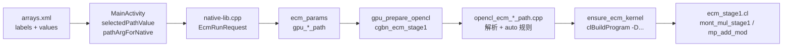

# Android ECM：高级算子路径（mul / sqr / add / sub）映射说明

本文说明 APK「高级选项」里四个下拉框（`ecm_mul_path_labels` 等）如何传到 native 层、如何参与 OpenCL **编译期**宏选择，以及最终在 `kernel_double_add` 内调用哪段 CL 实现。

桌面 `ecm.exe` 使用同一套 path 字符串（命令行 `--mul` / `--sqr` / `--add` / `--sub`），host 逻辑在 `src/cgbn_stage1_opencl.cpp` 与 `src/opencl_ecm_*_path.cpp`，与 Android 共用。

---

## 1. 总览



一次 ECM 运行只编译/缓存 **一个** OpenCL program（入口 kernel 名固定为 `kernel_double_add`）。  
路径选项不切换「不同的 .cl 文件 kernel 名」，而是通过 **预处理器宏** 在编译时选定 Montgomery 乘/方与模加/模减的实现；运行时在 `double_add_v2` 等内联函数里调用 `mont_mul_stage1` / `mp_add_mod`。

---

## 2. UI 层：标签与内部值

定义文件：`Android/ECM/app/src/main/res/values/arrays.xml`

每个算子有两列数组，**同索引一一对应**：

| 数组 | 用途 |
|------|------|
| `ecm_*_path_labels` | 下拉框显示文案 |
| `ecm_*_path_values` | 传给 native 的内部字符串 |

`MainActivity.kt`：

1. `setupEcmPathDropdowns()` — 用 labels 填充 `AutoCompleteTextView`，把 values 存到 `dropdown.tag`。
2. `selectedPathValue()` — 根据当前显示 label 查回 value。
3. `pathArgForNative()` — `"auto"` 或空 → 传 **空字符串** `""`（表示 host 默认/auto）；其它原样传递。

```kotlin
// 默认「自动」→ native 收到 ""
pathArgForNative(selectedPathValue(inputMulPath))
```

JNI 签名：`nativeRunEcm(..., mulPath, sqrPath, addPath, subPath, ...)`  
实现：`Android/ECM/app/src/main/cpp/native-lib.cpp` → `ecm_android_run.cpp`。

空字符串不会写入 `params->gpu_mul_path`（保持全零），后续 C 代码里以 `nullptr` 表示 auto：

```cpp
params->gpu_mul_path[0] ? params->gpu_mul_path : nullptr
```

---

## 3. Host：N 位数与 CGBN 容器

在 `cgbn_ecm_stage1()` 中：

```cpp
const size_t n_log2 = mpz_sizeinbase(N, 2);
uint32_t BITS = select_bits(n_log2);   // 512, 1024, …, 4096
const uint32_t limbs = BITS / 32;      // 16, 32, …, 128
```

| N 位数（约） | 典型 BITS | limbs | 说明 |
|-------------|-----------|-------|------|
| ≤ ~506 | 512 | **16** | 小整数 ECM；可走 i24 或 512 unroll |
| 421～991 等 | 1024～3584 | 32～112 | 通用 `mont_mul_stage1_unroll32` |
| 大 N | 4096 | **128** | 4096-bit Montgomery；`--mul`/`--sqr` 的 4096 路径生效 |

**4096 专用 path**（`unroll64_4096`、`fips4096` 等）仅在 `limbs == 128` 时使用；否则 host 打印 warning 并清零 `mul_path`/`sqr_path`。

---

## 4. Montgomery 路径（mul / sqr）

### 4.1 解析：`opencl_ecm_mont_path.cpp`

| UI / CLI 字符串 | `opencl_ecm_parse_mont4096_path` | 用途 |
|-----------------|-----------------------------------|------|
| `""`, `auto`, `default` | `0` (UNROLL64) | 4096 默认 unroll64 |
| `i24_384_manual` | `0`（非 4096 id） | 见 §4.2 |
| `unroll_only_512` | `0` | 见 §4.2 |
| `unroll64_4096` | `0` | 4096 默认 |
| `unroll64_4096_mt2` | `1` | 4096 + coop WG=2 |
| `fips4096` | `2` | FIPS4096 单线程 |
| `fips4096_mt8` | `3` | FIPS4096 × 8 |
| `fips4096_mt16` | `4` | FIPS4096 × 16 |

### 4.2 Stage-1 模式（&lt;4096-bit，尤其 512 容器）

`opencl_ecm_resolve_stage1_mont_mode(mul, sqr, n_bit_size)` 在 **编译 kernel 之前** 决定 `use_i24_384`：

| 条件 | 模式 | 日志中的 mul 名 |
|------|------|----------------|
| mul 或 sqr 为 `unroll_only_512` | `UNROLL512` | `mont_mul_priv_unroll_only_512` |
| mul 或 sqr 为 `i24_384_manual` | `I24_384` | `mont_mul_priv_i24_u32_blsub` |
| mul **与** sqr 均为 auto，且 `n_bit_size < 384` | `I24_384` | 同上 |
| 其它 | `UNROLL512` | `mont_mul_priv_unroll_only_512` |

`use_i24_384 = (mode == I24_384 && limbs == 16)`。

**说明：** UI 里的 `i24_384_manual` 表示「强制 i24 384 容器逻辑」，Stage-1 **实际**使用的是 `mont_mul_priv_i24_u32_blsub_body`（`mont_mul_unroll_i24.cl` 内 private u32 实现）。  
完全手动展开的 `mont_mul_unroll_i24_384_manual_generated.cl` 仅用于 App 内 **Montgomery bench**，不会拼进 Stage-1 的 `ecm_stage1.cl` 编译（避免 Adreno 编译超时/失败）。

i24 启用时 host 还会：

-  prepend `mont_mul_unroll_i24.cl`（去掉 `#pragma once` 与 `__global`/`__constant`，仅 helper 段）
- 用 `ecm_limb24_from_mpz` 编码 N 与曲线数据
- 编译加 `-DECM_STAGE1_USE_I24_384=1 -DMP_LIMB_BITS=24`
- 内核内 add/sub 走 24-bit radix 版本（`mp_*_i24`）

### 4.3 编译宏 → `ecm_stage1.cl` 内联函数

`ensure_ecm_kernel()` 调用 `clBuildProgram`，关键 `-D`：

```
-DMAX_LIMBS=<limbs>
-DECM_STAGE1_MUL_PATH=<mul_path>      // 0..4，4096 专用
-DECM_STAGE1_SQR_PATH=<sqr_path>
-DECM_STAGE1_USE_I24_384=<0|1>
-DECM_STAGE1_COOP_WG=<1|2|8|16>       // limbs==128 且 mt* 路径
-DECM_STAGE1_HAS_FIPS4096=<0|1>       // 是否链接 ecm_stage1_mont4096_paths.cl
```

`mont_mul_stage1()` / `mont_sqr_stage1()` 分发（`ecm_stage1.cl`）：

| limbs | 条件 | OpenCL 实现 |
|-------|------|-------------|
| 16 | `ECM_STAGE1_USE_I24_384` | `mont_mul_priv_i24_u32_blsub_body` |
| 16 | 否则 | `mont_mul_stage1_unroll_only_512`（内联 512 CIOS） |
| 128 | `ECM_STAGE1_MUL_PATH == 2` | `mont_mul_stage1_fips4096` |
| 128 | 否则 | `mont_mul_stage1_unroll64_4096` |
| 其它 | — | `mont_mul_stage1_unroll32` |

4096 且 `ECM_STAGE1_COOP_WG > 1` 时走 `mont_*_stage1_coop()`，按 `ECM_STAGE1_MUL_PATH` / `SQR_PATH` 选 mt2 / fips mt8 / mt16 等（见 `ecm_stage1.cl` 约 1220 行起）。

运行日志确认行：

```
GPU: stage1 operators: mul=..., sqr=..., addmod=..., submod=...
```

---

## 5. 模加 / 模减路径（add / sub）

### 5.1 解析：`opencl_ecm_addsub_path.cpp`

| UI value | enum id | 名称 |
|----------|---------|------|
| `""` / `auto` | （解析为 -1，走 resolve） | 见 §5.2 |
| `fused` | 0 | `fused` |
| `fused_unroll` | 1 | `fused_unroll` |
| `fused_unroll_b32` | 2 | `fused_unroll_b32` |
| `asm_b32` | 3 | `asm_b32` |
| `fused_unroll_b16` | 4 | `fused_unroll_b16` |
| `asm_b16` | 5 | `asm_b16` |

sub 下拉无 `asm_b16`（与 desktop CLI 一致）。

### 5.2 Auto 默认（`opencl_ecm_resolve_addsub_path`）

| limbs | GPU 厂商 | add 默认 | sub 默认 |
|-------|----------|----------|----------|
| 128 (4096) | AMD | `asm_b32` | `fused_unroll_b32` |
| 128 | 其它 | `fused_unroll_b32` | `fused_unroll_b32` |
| 16 (512) | AMD | `asm_b16` | `fused_unroll_b16` |
| 16 | 其它（Adreno） | `fused_unroll_b16` | `fused_unroll_b16` |
| 其它 | — | `fused_unroll` | `fused_unroll` |

**i24 模式**（`ECM_STAGE1_USE_I24_384`）：仍按上述 id 编译，但 `mp_add_mod` / `mp_sub_mod` 在 `limbs==16` 时优先调用 **`mp_*_fused_unroll_i24`**（24-bit limb radix），与 Montgomery i24 数据布局一致。

### 5.3 编译期注入

```
-DECM_STAGE1_ADDMOD_PATH=<add_path>
-DECM_STAGE1_SUBMOD_PATH=<sub_path>
-DECM_STAGE1_ASM_B32=<0|1>   // 为 true 时 prepend asm_block32_stage1.cl
-DECM_STAGE1_ASM_B16=<0|1>   // 为 true 时 prepend asm_block16_stage1.cl
```

`mp_add_mod()` / `mp_sub_mod()` 按 `ECM_STAGE1_*_PATH` 与 `limbs` 选择 `mp_add_mod_fused_unroll_b16_512`、`mp_add_mod_asm_b32_4096` 等（`ecm_stage1.cl`）。

---

## 6. `ecm_mul_path_labels` 完整对照表

以下为 **mul 下拉**（sqr 与 mul 选项集相同；add/sub 见 §5）。

| 显示 label（arrays.xml） | value → native | Host 解析 | 实际 OpenCL（典型：301-bit N） | 实际 OpenCL（4096-bit N） |
|--------------------------|----------------|-----------|--------------------------------|---------------------------|
| 自动 (&lt;384b → i24 u32) | `auto` → `""` | auto + N&lt;384 → i24 | `mont_mul_priv_i24_u32_blsub` | N/A（limbs≠16 时不启用 i24） |
| 自动（N≥384） | `auto` → `""` | auto → unroll512 | `mont_mul_priv_unroll_only_512` | 若 BITS=4096：`unroll64_4096` |
| `i24_384_manual` | 同左 | 强制 i24 | `mont_mul_priv_i24_u32_blsub` | i24 不启用（limbs=128） |
| `unroll_only_512` | 同左 | 强制 512 | `mont_mul_priv_unroll_only_512` | 512 路径（若 limbs=16） |
| `unroll64_4096 (4096-bit)` | `unroll64_4096` | path id 0 | 被 ignore（warning） | `mont_mul_stage1_unroll64_4096` |
| `unroll64_4096_mt2` | `unroll64_4096_mt2` | path id 1 | ignore | unroll64 + coop WG=2 |
| `fips4096` | `fips4096` | path id 2 | ignore | `mont_mul_stage1_fips4096` |
| `fips4096_mt8` | `fips4096_mt8` | path id 3 | ignore | fips + coop 8 |
| `fips4096_mt16` | `fips4096_mt16` | path id 4 | ignore | fips + coop 16 |

sqr 列与 mul 相同，由 `ECM_STAGE1_SQR_PATH` 独立控制；auto 时 i24 判定 **mul 与 sqr 都必须是 auto** 才会因 N&lt;384 选 i24。任一侧指定 `unroll_only_512` 即强制 512 路径。

---

## 7. OpenCL 源码与 APK assets

Gradle `preBuild` 同步（`app/build.gradle.kts` → `syncEcmStage1Kernels`）：

| 源（repo） | APK assets |
|------------|------------|
| `cgbn/backends/opencl/kernels/ecm_stage1.cl` | `assets/kernels/cgbn/backends/opencl/kernels/` |
| `ecm_stage1_mont4096_paths.cl` | 同上 |
| `mont_mul_unroll_i24.cl` | 同上（i24 时 host 动态 prepend） |
| `mp_addsub/stage1/asm_block{16,32}_stage1.cl` | 同上 |

运行时加载：`cgbn::opencl::load_kernel_file()` → Android 上 `android_load_kernel_asset()`（`kernel_assets.cpp`）。

Program 缓存 key 含 **完整源码 + build options**；更改 path 或 N 位数导致 `MAX_LIMBS` / `USE_I24_384` 变化时会重新编译。

---

## 8. 如何新增一条路径

1. **arrays.xml** — 在对应 `*_labels` / `*_values` 增加同索引条目。  
2. **Host 解析** — `opencl_ecm_mont_path.cpp` 或 `opencl_ecm_addsub_path.cpp` 增加字符串 → id。  
3. **Kernel** — 在 `ecm_stage1.cl`（及必要时 `ecm_stage1_mont4096_paths.cl`）增加 `#if ECM_STAGE1_*` 分支。  
4. **ensure_ecm_kernel** — 若需额外 `.cl` 片段或新 `-D`，在 `cgbn_stage1_opencl.cpp` 拼接源码与 `snprintf(opts, ...)`。  
5. **日志名** — 更新 `opencl_ecm_stage1_mont_mode_name()` 或 `opencl_ecm_addsub_path_name()`，便于对照 `GPU: stage1 operators:` 行。  
6. **Rebuild** — 修改 repo 内 `cgbn/...` 后执行 Gradle build，触发 `syncEcmStage1Kernels`。

---

## 9. 调试建议

| 现象 | 检查 |
|------|------|
| 路径似乎未生效 | 日志 `GPU: stage1 operators:` 四元组；对比 §6 表 |
| i24 未启用 | N 是否 ≥384；mul/sqr 是否都为 auto；BITS 是否为 512（limbs=16） |
| 4096 path 无效 | `Parsed N bit-size` 是否达到 4096 容器；是否出现 `4096 paths ignored` |
| 编译失败 | 日志 `OpenCL build log:`；确认未对整文件 `#define __global` 空宏 |
| bench 与 stage1 混淆 | `i24_384_manual` bench kernel 在 `mont_mul_unroll_i24_bench.cl`；stage1 用 `mont_mul_priv_i24_u32_blsub` |

环境变量（与 desktop 相同，可选）：

- `ECM_STAGE1_FORCE_NORMALIZE`
- `ECM_MP_ADD_MOD_FUSED_UNROLL`
- `CGBN_OPENCL_DEVICE_INDEX`

---

## 10. 相关源文件索引

| 层级 | 路径 |
|------|------|
| UI 资源 | `Android/ECM/app/src/main/res/values/arrays.xml` |
| UI 逻辑 | `Android/ECM/app/src/main/java/.../MainActivity.kt` |
| JNI / 运行 | `Android/ECM/app/src/main/cpp/ecm_android_run.cpp` |
| Stage-1 host | `src/cgbn_stage1_opencl.cpp` |
| Montgomery path | `src/opencl_ecm_mont_path.cpp`, `.h` |
| Add/sub path | `src/opencl_ecm_addsub_path.cpp`, `.h` |
| i24 host 算术 | `src/opencl_ecm_limb24.cpp` |
| 主 OpenCL kernel | `cgbn/backends/opencl/kernels/ecm_stage1.cl` |
| i24 Montgomery CL | `cgbn/backends/opencl/kernels/mont_mul_unroll_i24.cl` |
| 4096 Montgomery CL | `cgbn/backends/opencl/kernels/ecm_stage1_mont4096_paths.cl` |
